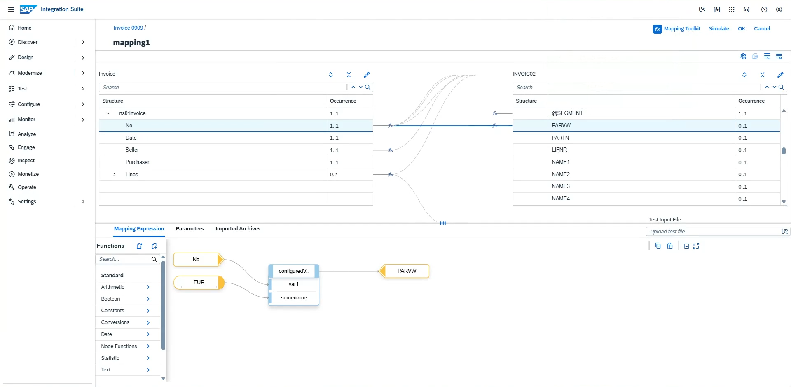
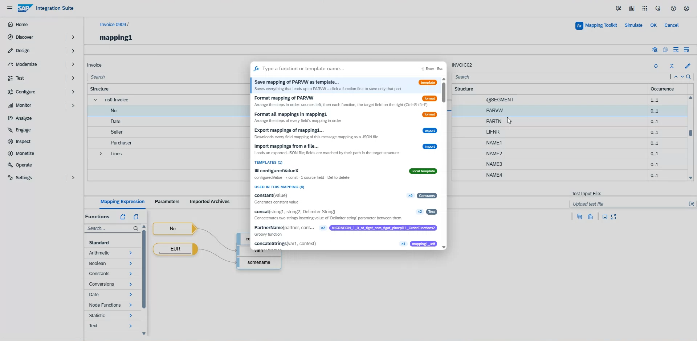
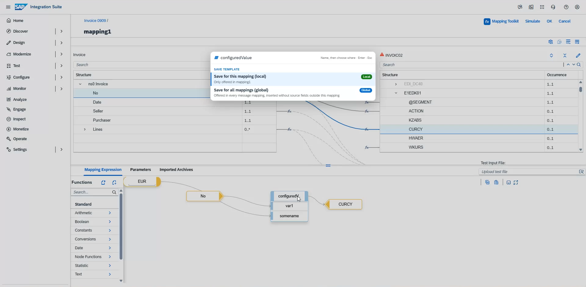
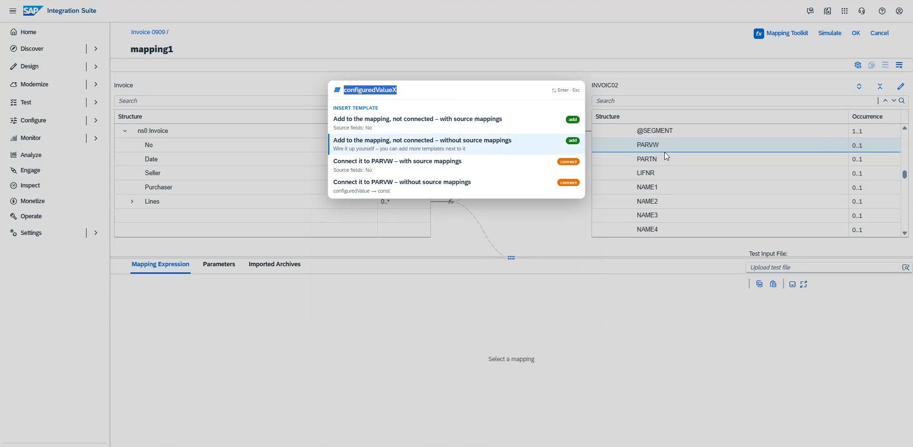
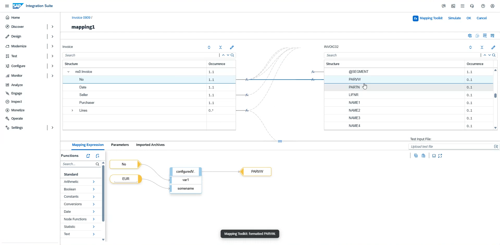
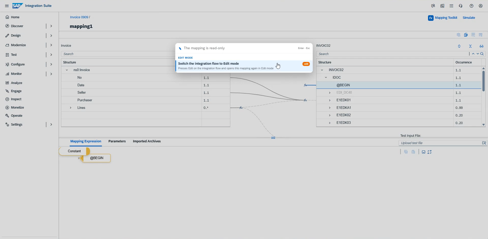

# CI Mapping Toolkit

**Quick actions for the SAP Cloud Integration message mapping editor.**

CI Mapping Toolkit is a small Chrome extension that makes the graphical message mapping editor in
SAP Integration Suite / SAP Cloud Integration (CPI) faster to work with. It brings back the kind of
quick, keyboard-driven editing many developers were used to from the SAP PI/PO 7.31 mapping editor:
select a target field, press **Space**, type a few letters and the function is there – already
connected.

The goal is simple: spend less time dragging boxes and hunting through the function palette, and more
time on the actual integration. It takes care of the things that are tedious in the standard editor –
adding constants, reusing the same logic in many fields, tidying up a messy expression, copying
mappings between message mappings, or getting a read-only mapping into Edit mode.

### Watch the introduction

A short walkthrough of the toolkit in a real message mapping: [youtu.be/SU1wsei3DT4](https://youtu.be/SU1wsei3DT4)

> **Looking for more?** CI Mapping Toolkit is a free helper for one part of the job. For managing,
> testing, documenting and transporting your integrations end to end, have a look at the
> [Figaf Tool](https://figaf.com), which gives you far more productivity across SAP Integration Suite
> and SAP PI/PO.

---

## Contents
- [Features](#features)
- [Installation](#installation)
- [Getting started](#getting-started)
- [Keyboard shortcuts](#keyboard-shortcuts)
- [Feature guide](#feature-guide)
- [How it works and limitations](#how-it-works-and-limitations)
- [Roadmap](#roadmap)
- [Contributing](#contributing)
- [License](#license)

## Features

| | |
|---|---|
| **Quick functions** | Select a target field, press **Space**, type part of a function name (`conc`, `fbe` for *formatByExample* …) and press Enter. Standard functions, UDFs and imported function libraries are all included. Functions already used in the mapping are listed first. |
| **Instant mapping** | If the target field is not mapped yet, the mapping is created and the function is connected to the field right away – no dragging. |
| **Constants in one step** | Choose *constant*, type the value, press Enter: `Constant "ABC" → field`. |
| **Templates** | Save the mapping of a field – or just one function and everything feeding it – as a template, for this mapping (*local*) or for all mappings on all tenants (*global*). Insert it again later, connected or not, with or without its source fields. |
| **Format** | Arrange a mapping's steps in order, left to right, with one keystroke (**Ctrl+Shift+F**) or for all fields at once. |
| **Export / import** | Download all field mappings of a message mapping as JSON and load them into another mapping. |
| **Edit mode switch** | Opened a mapping while the integration flow was read-only? Press Space and switch the flow to Edit mode without leaving the mapping. |

## Installation

The toolkit is not in the Chrome Web Store (yet). You load it into Chrome yourself as an "unpacked"
extension. That also means you have the full source and can adapt it to your own needs.

1. **Get the code** – either
   - download the repository as a ZIP file (*Code → Download ZIP*) and unzip it, or
   - clone it: `git clone <repository-url>`
2. Open **`chrome://extensions`** in Chrome (or `edge://extensions` in Microsoft Edge).
3. Turn on **Developer mode** (top right).
4. Click **Load unpacked** and select the folder that contains `manifest.json`.
5. Open (or reload) your SAP Integration Suite tab.

The extension runs on `https://*.hana.ondemand.com/*` and `https://*.cloud.sap/*` and only becomes active
in the message mapping editor.

**Updating:** replace the files (or `git pull`), then click the reload icon on the extension in
`chrome://extensions` and reload the Integration Suite tab.

## Getting started

1. Open an integration flow in SAP Integration Suite and open one of its message mappings.
2. If it is read-only, press **Space** and choose **Switch the integration flow to Edit mode**.
3. Click a field in the **target** structure.
4. Press **Space** – or click **Mapping Toolkit** next to *Simulate*.
5. Type `const`, press **Enter**, type a value and press **Enter** again.
   The field is now mapped to that constant.
6. Try a function: select another field, press **Space**, type `concat` and press **Enter**.
7. When you are done, click **OK** and **Save** as usual. Nothing the toolkit does is stored until you
   save in CPI – **Cancel** discards it.

## Keyboard shortcuts

| Key | Where | What it does |
|---|---|---|
| **Space** | Mapping editor, not typing in a field | Open the search box for the selected target field |
| **Ctrl+Space** | Mapping editor | Open the search box (always works) |
| **Ctrl+Shift+F** | Mapping editor, mapped field selected | Format the mapping of the selected field |
| **↑ / ↓, PgUp / PgDn** | Search box | Move through the list |
| **Enter** | Search box | Insert / choose |
| **Del** | Search box, on a template | Delete the template |
| **Esc** | Search box | Close |

Plain Space never interferes with typing: in a text field (a constant's value, a search field, the script
editor) or on a focused button it keeps its normal meaning.

## Feature guide

### Functions and constants
- The list matches by prefix, substring, camelCase initials (`fbe` → *formatByExample*) and description.
- Order: functions used in this mapping (with a usage count), your recently used functions, then all
  functions A–Z.
- A new function is placed at the mouse position when the mouse is over the Mapping Expression canvas,
  otherwise next to the target field.
- For an unmapped field the function is connected to the field. For a mapped field it is added so you
  can wire it where you want.

### Templates
- **Save the whole field:** select a mapped field, open the box and choose
  *Save mapping of … as template…*. Everything that leads up to the field is saved: functions,
  constants, parameters and source fields.
- **Save part of it:** open the **•••** menu of a function on the canvas and choose
  **Save as template…**. That function and everything feeding it is saved.
- **Local or global:** *local* templates are offered only in the mapping they were saved in; *global*
  templates in every message mapping on every tenant.
- **Insert:** templates appear under *Templates* in the box. By default a template is **added to the
  mapping without being connected**, below what is already there – so you can combine several templates
  and wire them together. You can also connect it to the field directly (replacing its mapping).
  In the mapping it came from you choose *with* or *without* source mappings; elsewhere it is always
  inserted without them.
- **Delete:** select the template in the box and press **Del**.

### Format
- **Ctrl+Shift+F**, *Format mapping of …* in the box, or **Format mapping** in a box's **•••** menu.
- Sources and constants on the left, each function one column left of what it feeds, the target field on
  the right, inputs in pin order, about one box of space between columns.
- *Format all mappings in …* tidies every field of the message mapping.

### Export and import
- *Export mappings of …* downloads every field mapping as `<mapping>.mappings.json`.
- *Import mappings from a file…* loads such a file. Fields are matched by their path in the target
  structure. Choose to overwrite fields that are already mapped, or to fill only fields that are not
  mapped yet. The result tells you how many fields were added, overwritten, left unchanged, not found
  in this structure, or use source fields that are missing here.

### Switch to Edit mode
If the mapping is read-only, the box offers **Switch the integration flow to Edit mode**. It presses
*Edit* on the integration flow and opens the same mapping again in Edit mode – you stay where you are.
If CPI asks something first (for example to take over an older session of yours), answer it and the
toolkit continues.

## How it works and limitations
- The extension runs inside the SAP Integration Suite page and uses the SAPUI5 controls of the mapping
  editor (the same functions the editor uses itself, e.g. to create a constant mapping or open a
  resource). These are **internal, undocumented parts of SAP's UI and can change with any CPI
  release**. If something stops working after an SAP update, please open an issue.
- Nothing is sent anywhere. Templates are stored in the browser (`chrome.storage.local`) on your
  computer; other settings in the tenant's local storage.
- Changes are only saved when you save in CPI. Try new features on a copy or a test flow first.
- Not affiliated with or endorsed by SAP. SAP, SAP Integration Suite and SAP Cloud Integration are
  trademarks of SAP SE.

### Project structure
| File | Purpose |
|---|---|
| `manifest.json` | Chrome extension manifest (Manifest V3) |
| `quickfunction.js` | Everything that runs in the mapping editor: search box, templates, format, export/import |
| `bridge.js` | Gives the page script access to `chrome.storage` for templates |
| `icons/` | Extension icons |

## Roadmap
The toolkit is shared as source so users can try it and improve it. Ideas being considered:
- Publishing it in the Chrome Web Store, or as a plugin for another CPI browser extension.
- More quick actions in the mapping editor.
- Sharing templates within a team.

Suggestions are welcome – open an issue.

## Contributing
Issues and pull requests are welcome. Load the folder as an unpacked extension (see
[Installation](#installation)), make your change, click reload on the extension and reload the
Integration Suite tab to try it.

## License
[Apache License 2.0](LICENSE)
